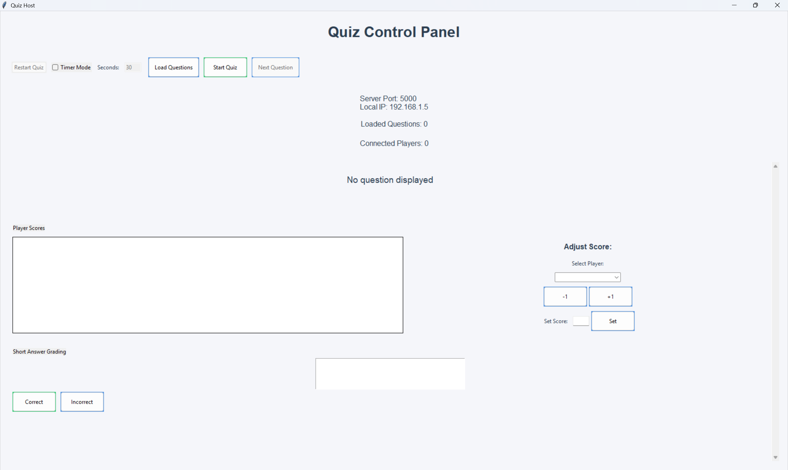
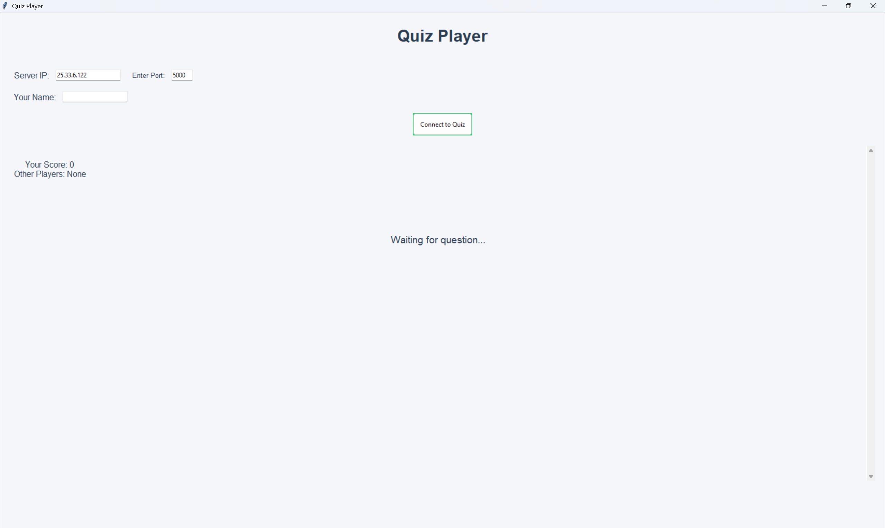

# Installation

## Clone the Repository:
```bash
git clone https://github.com/yourusername/myKahoot.git
cd myKahoot
```

## Install Dependencies:
```bash
pip install -r requirements.txt
```

## Prepare Resources:
- Place your Excel question file in the project directory.
- Store optional question images in the `resource/image/` folder.

# Usage

## Running the Server
Start the quiz server:
```bash
cd server
python server.py
```
The server GUI will display:
- Local IP or Hamachi IP (if available) and port (default: 5000).
- Options to load questions, start the quiz, and manage players.
- Load an Excel question file via the "Load Questions" button.
- Click "Start Quiz" once players are connected.

## Running the Client
Start the client on each player’s device:
```bash
cd client
python client.py
```
In the client GUI:
- Enter the Server IP (from the server’s display).
- Enter the Port (default: 5000).
- Input your Player Name.
- Click "Connect to Quiz".
- Answer questions as they appear and track your score in real time.

# Workflow
- **Server**: Loads questions, starts the quiz, sends questions to clients, and manages scores.
- **Clients**: Connect to the server, receive questions, submit answers, and view scores.
- **Gameplay**: The host advances to the next question after all players answer or the timer expires (if enabled).

# Question File Format
Create an Excel file (.xlsx) with the following columns:
| question         | option_1      | option_2 | option_3 | option_4 | correct_answer | image_link |
|------------------|---------------|----------|----------|----------|----------------|------------|
| What is 2 + 2?   | 3             | 4        | 5        | 6        | 2              | math.jpg   |
| Explain the sun  | The star...   |          |          |          |                | sun.jpg    |

- **Multiple Choice**: Fill all `option_1` to `option_4` and set `correct_answer` (1-4).
- **Short Answer**: Fill only `option_1` (correct answer) and leave `correct_answer` blank.
- **Image (Optional)**: Add a filename (e.g., `math.jpg`) in `image_link`. Place the image in `resource/image/`.

Example: See `resource/Test 01.xlsx` in the repository (if included).

# Screenshots

*The server GUI showing options to load questions, start the quiz, and manage players.*

*The client GUI where players can connect to the server, enter their name, and participate in the quiz.*

# Note
- Built with inspiration from Kahoot, Quizziz and similar quiz platforms.